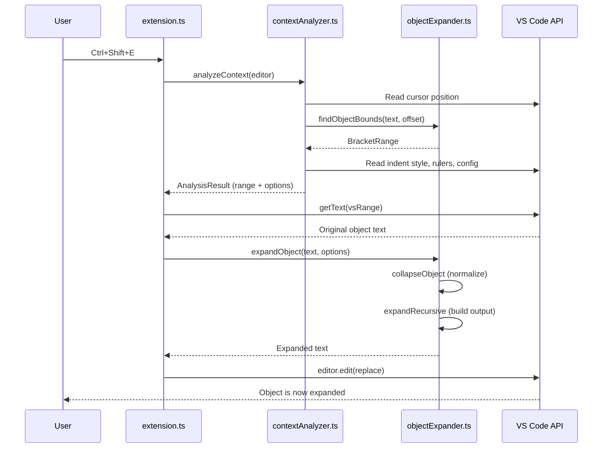

# JS Object Expander — Technical Documentation

This document describes the internal architecture of the JS Object Expander VS Code extension: what each part does, how data flows through the system, and why certain design decisions were made.

---

## Architecture Overview

The extension is structured around three main modules with clear separation of concerns:

- **extension.ts (Orchestrator)**: Handles VS Code integration, registering commands and event listeners. It orchestrates user actions like keystrokes or file saves, delegating to the other modules for analysis and expansion.

- **contextAnalyzer.ts (VS Code Bridge)**: Acts as the interface to VS Code APIs. It analyzes the current editor context, reads configuration settings, and prepares data for the expansion logic without exposing VS Code dependencies.

- **objectExpander.ts (Pure Logic)**: Contains the core business logic for parsing, scoring, and transforming JavaScript objects. It operates purely on text and numbers, making it testable and reusable.

Data flow starts from user actions in VS Code, which trigger commands in extension.ts. These commands call contextAnalyzer.ts to gather context and configuration, then pass the results to objectExpander.ts for the actual transformation. The transformed text is then applied back to the editor.

This modular design ensures that the core logic remains independent of VS Code specifics, facilitating testing and potential reuse in other environments.

--- 

## Module Breakdown

### `extension.ts` — The Orchestrator

This is the entry point that VS Code loads. Its job is simple: register commands, wire up the save listener, and call into the other two modules.

#### Key Functions

| Function | Purpose |
|---|---|
| `activate()` | Called once when the extension loads. Registers the three commands and the save listener. |
| `deactivate()` | Cleanup hook — currently a no-op since all disposables are managed via `context.subscriptions`. |
| `smartExpand()` | Calls `analyzeContext()` to find the object at the cursor, then `expandObject()` to expand it. Replaces the text via `editor.edit()`. |
| `smartCollapse()` | Same pattern, but uses `collapseObject()` instead. |
| `toggle()` | Checks `isExpanded()` to decide which direction to go, then calls the appropriate function. |
| `formatDocumentObjects()` | Used by the save listener. Calls `analyzeForDocument()` to find all top-level brackets, scores each one with `getComplexity()`, and expands those above the threshold. |

#### Why it exists as a separate file

It would be easy to dump everything into one big file, but separating the VS Code command glue from the business logic makes the codebase much easier to navigate. When you open `extension.ts`, you immediately see "here are the three commands and the save hook" without getting distracted by parsing algorithms.

---

### `contextAnalyzer.ts` — The VS Code Bridge

This is the _only_ module that imports the `vscode` API. It reads editor state and configuration, then packages everything into an `ExpandOptions` object that the expander can consume without knowing anything about VS Code.

#### Key Functions

| Function | Purpose |
|---|---|
| `readConfig()` | Pulls the five extension settings from `vscode.workspace.getConfiguration()`. Returns a typed `ExtensionConfig` object. |
| `isFormatOnSaveEnabled()` | Convenience wrapper — just checks the `formatOnSave` setting. Used by `extension.ts` as a quick guard. |
| `getIndentUnit()` | Reads the editor's tab/spaces preference and tab size. Returns the string used for one indent level (e.g. `"  "` for 2-space indent). |
| `getAvailableWidth()` | Determines how many characters fit on a line. Uses the first ruler, or the word-wrap column, or 120 as a fallback. Subtracts the column where the opening brace sits. |
| `getBaseIndent()` | Grabs the leading whitespace from the line where the opening bracket is. This becomes the base indentation for all generated lines. |
| `analyzeContext()` | The main function for single-object commands. Finds the bracket pair at the cursor, reads all the editor settings, and returns an `AnalysisResult` ready for expansion. |
| `analyzeForDocument()` | The format-on-save variant. Scans the whole document for top-level brackets and returns an `AnalysisResult[]` in reverse order. |

#### Why the VS Code boundary matters

By isolating all VS Code calls here, the core expansion logic in `objectExpander.ts` stays completely pure — no mocking `vscode` during tests, no coupling to editor state. If someone wanted to use the expander in a CLI tool or a different editor, they'd only need to replace this one module.

#### The `AnalysisResult` type

```typescript
interface AnalysisResult {
  fullText: string;       // the entire document text
  range: BracketRange;    // character offsets of the bracket pair
  vsRange: vscode.Range;  // the same range as VS Code positions (for editor.edit())
  options: ExpandOptions; // everything the expander needs
}
```

This acts as the handoff contract between the analyzer and the expander.

---

### `objectExpander.ts` — The Pure Logic Engine

The largest module, and the heart of the extension. Handles all parsing, scoring, expanding, and collapsing. Has zero dependency on VS Code — it works entirely with strings and numbers.

#### Skip Zones

Before doing anything with brackets, we need to know which parts of the code to ignore. Brackets inside strings, comments, and template literals aren't real structure — they're just characters.

`buildSkipZones()` scans the text once and produces an array of `[start, end]` offset pairs marking these "skip zones". Every other function that walks through code checks against these zones using the `makeSkipCheck()` helper.

**Handled zone types:**
- Single-line comments (`// ...`)
- Block comments (`/* ... */`)
- Template literals (`` ` ... ` ``)
- String literals (`"..."` and `'...'`)

#### Bracket Finding

Two functions handle bracket location:

**`findObjectBounds(text, offset)`** — Used for cursor-based commands. Walks left from the cursor to find an opening `{` or `[`, tracking a depth stack to skip over nested bracket pairs. Then walks right from that opener to find the matching closer.

**`findAllTopLevelBrackets(text)`** — Used for format-on-save. Scans left-to-right through the entire document. When it hits an opener, it finds the matching closer and records the pair, then jumps past it (so nested brackets inside it aren't reported as separate top-level pairs). Returns results in reverse order so text edits can be applied from the bottom up without invalidating earlier offsets.

#### Complexity Scoring

`getComplexity()` assigns a numeric score to the content between brackets using three weighted factors:

```
score = round(charLength × 0.3 + commaCount × 8 + maxDepth × 12)
```

| Factor | Weight | Rationale |
|---|---|---|
| Character length | 0.3 | Longer content generally benefits from expansion, but length alone shouldn't trigger it |
| Comma count | 8 | Each comma roughly equals one more entry — the real driver of readability benefit |
| Max nesting depth | 12 | Deeply nested structures are hardest to read on one line |

**Calibration:** A simple `{ a: 1 }` scores ~10. A typical MongoDB subdocument with 5-6 fields and some nesting lands at 50-80. The default threshold of 40 catches most things that genuinely benefit from expansion while leaving trivial objects alone.

#### Collapse

`collapseObject()` is straightforward: flatten newlines, normalize whitespace, clean up bracket spacing, and remove trailing commas. The result is always a single-line representation with consistent formatting (`{ key: value, other: stuff }`).

This is also used as the first step of expansion — collapse first, then re-expand from a clean state. This guarantees consistent output regardless of what the input looked like.

#### Expand

The expansion pipeline works like this:

1. **`expandObject()`** — Public entry point. Collapses the input first (to normalize), then delegates to `expandRecursive()`.

2. **`expandRecursive()`** — The recursive core. For each nesting level:
   - Parse the content with `splitEntries()` to get individual entries
   - Check if a single-line representation would fit and isn't too complex
   - If not, build multi-line output with proper indentation
   - For each entry, call `tryExpandNested()` to handle nested structures

3. **`splitEntries()`** — Splits at top-level commas while respecting nested brackets and strings. Returns an array of entry strings.

4. **`tryExpandNested()`** — Finds the first nested `{ }` or `[ ]` inside an entry (like the `{ email: "..." }` in `contact: { email: "..." }`), checks its complexity, and expands it in place if it's complex enough.

#### Trailing Comma Handling

`pickTrailingComma()` implements three strategies:
- **`always`**: Every last entry gets a trailing comma (the default — matches modern JS style)
- **`never`**: No trailing commas ever
- **`preserve`**: Defaults to no trailing comma for collapsed inputs (since the original trailing comma information is lost during collapse)

---

## Data Flow

Here's what happens when you press `Ctrl+Shift+E` on a line containing an object:



The format-on-save flow is similar, but instead of `analyzeContext()` it uses `analyzeForDocument()` to find all top-level brackets, and the edits are batched into a single `editor.edit()` call.

---

## Configuration System

All settings live under the `jsObjectExpander` namespace in VS Code's configuration. They're defined in `package.json` under `contributes.configuration` and read at runtime by `contextAnalyzer.ts`.

Settings are read fresh on every command invocation (not cached), so changes take effect immediately without reloading.

| Setting | Type | Default | Used By |
|---|---|---|---|
| `complexityThreshold` | number | 40 | `expandRecursive()`, `formatDocumentObjects()` |
| `trailingCommas` | enum | "always" | `pickTrailingComma()` |
| `maxExpandDepth` | number | 10 | `expandRecursive()` |
| `collapseOnSingleProperty` | boolean | true | `expandRecursive()` |
| `formatOnSave` | boolean | false | `onWillSaveTextDocument` listener |

---

## Format-on-Save Pipeline

When enabled (`jsObjectExpander.formatOnSave: true`), the extension hooks into VS Code's `onWillSaveTextDocument` event. The pipeline:

1. **Guard check** — Bail out if format-on-save is disabled or the file isn't a supported language
2. **Find editor** — Match the saving document to a visible editor (needed for indent/width info)
3. **Scan document** — `analyzeForDocument()` finds all top-level bracket pairs
4. **Score & filter** — Each bracket pair's inner content is scored; only those above the threshold proceed
5. **Batch expand** — All qualifying objects are expanded in a single `editor.edit()` call
6. **Offset safety** — Results are processed bottom-to-top so edits don't invalidate each other's positions

---

## File Summary

| File | Lines | Role | VS Code dependency |
|---|---|---|---|
| `extension.ts` | ~120 | Command registration, save listener | Yes (imports vscode) |
| `contextAnalyzer.ts` | ~140 | Reads editor state, produces ExpandOptions | Yes (imports vscode) |
| `objectExpander.ts` | ~310 | Parsing, scoring, expanding, collapsing | **No** |
| `package.json` | ~145 | Extension manifest, commands, settings | N/A |
